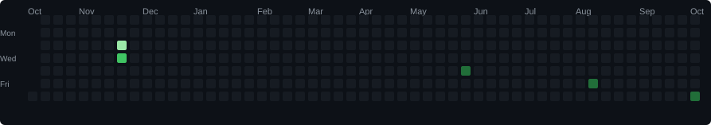

# 💫 About Me:

<h2>
Hi, I'm <strong>Arnab Kumar Jana</strong>, a <strong>B.Tech student in Computer Science and Engineering (Artificial Intelligence & Robotics)</strong> with a strong passion for technology, software development, artificial intelligence, and robotics. I enjoy building innovative solutions, solving real-world problems through programming, and continuously expanding my technical knowledge.
</h2>

<small>
I have a strong foundation in programming languages including <strong>Python, C, Java, JavaScript, HTML, and CSS</strong>. Alongside programming, I have studied core computer science subjects such as <strong>Data Structures and Algorithms (DSA)</strong>, <strong>Database Management Systems (DBMS)</strong>, <strong>Computer Organization and Architecture (COA)</strong>, <strong>Operating Systems (OS)</strong>, <strong>Computer Networks (CN)</strong>, <strong>Object-Oriented Programming (OOP)</strong>, and <strong>Robotics Operating System (ROS)</strong>.
</small>

<small>
I am passionate about <strong>Artificial Intelligence, Machine Learning, Robotics, Full-Stack Web Development, Cloud Technologies, and Software Engineering</strong>. I enjoy creating projects that combine creativity with practical problem-solving while following modern development practices and writing clean, efficient, and scalable code.
</small>

<small>
For backend development and cloud-based applications, I have experience working with <strong>Supabase</strong> for databases and authentication. I use <strong>Git</strong> and <strong>GitHub</strong> for version control and collaboration, and I deploy applications using platforms such as <strong>Render</strong>. I am always eager to learn new frameworks, tools, and technologies that help build secure, scalable, and high-performance applications.
</small>

<small>
My goal is to become a skilled <strong>AI Engineer and Software Developer</strong>, building intelligent applications that make a meaningful impact. I believe in continuous learning, teamwork, innovation, and delivering high-quality software through practical experience and modern engineering practices. I am constantly seeking opportunities to enhance my skills, contribute to exciting projects, and grow as a technology professional.
</small>

---

## 🌐 Socials:

    

---

# 💻 Tech Stack:

                                  

---

# 📊 GitHub Stats:

  

 

  

 

  

---
# 📈 GitHub Activity:

  

---

## 👀 Profile Views:

  

---

## 🚀 Thanks for visiting my profile!

  ⭐ <strong>Feel free to explore my repositories and projects.</strong>

<!-- Proudly created with GPRM -->
